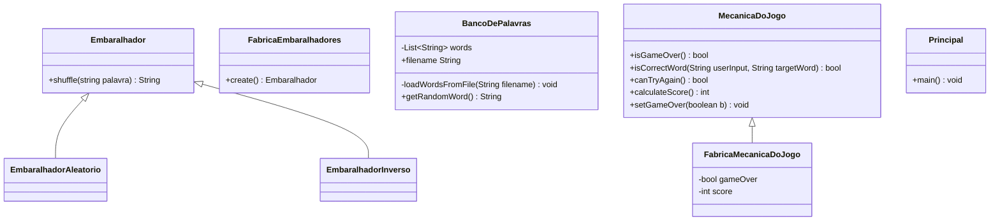

# Jogo das palavras embaralhadas

## Descrição

O objetivo desse exercício é criar um jogo onde partes de sua execução possam ser trocadas.
O jogo é simples: é apresentado ao jogador uma palavra com as letras embaralhadas e o jogador deve
tentar adivinhar a palavra correta. O jogo será jogado no próprio console e a lista de palavras utilizadas
pode ser fixa (pelo menos 20).

O jogo deve possuir os seguintes componentes com as seguintes responsabilidades:

- `Principal`: representa a classe com o método main(). É essa classe que é responsável por ler
a entrada do usuário e por imprimir as informações no console. Nenhuma outra classe pode
imprimir ou ler do console;
- `BancoDePalavras`: classe que possui um método que retorna uma palavra retirada
aleatóriamente de uma lista de palavras lida a partir de um arquivo;
- `Embaralhador`: interface que representa classes reponsáveis por receber uma palavra e
retornar ela embaralhada. Pelo menos duas implementações deverão ser feitas;
- `FabricaEmbaralhadores`: possui um método que retorna um embaralhador
aleatóriamente;
- `MecanicaDoJogo`: interface que representa o andamento e a lógica do jogo. É responsável
por ditar o andamento do jogo. Ela que vai dizer se o jogo acabou ou não, se o usuário acertou a
palavra ou não, se o usuário pode tentar acertar a palavra novamente e qual foi a pontuação final
do jogador. Pelo menos duas implementações dessa interface devem ser criadas;
- `FabricaMecanicaDoJogo`: retorna a MecanicaDoJogo que deve ser utilizada.

A classe `Principal` deve recuperar a instância de MecanicaDoJogo de FabricaMecanicaDoJogo e não
pode conter nenhuma referência direta a uma das implementações, apenas a interface. Da mesma
forma, as implementações de MecanicaDoJogo devem recuperar os embaralhadores de
FabricaEmbaralhadores e também não pode conter nenhuma referência direta a implementações de
Embaralhador, apenas a interface.

As implementações de embaralhador devem conter algoritmos para o embaralhamento de palavras.
Exemplo: inverter string, permutar randomicamente, trocar letras impares por pares e etc...
As implementações de MecanicaDoJogo devem retratar o andamento do jogo. Exemplos de questões
que podem mudar: quando o jogo termina (após um número fixo de palavras, após um número de
erros); quantas tentativas podem ser feitas por palavra; como são computados os pontos; qual
embaralhador será utilizado e em que momento; e etc... O importante é que independente do
funcionamento, a classe Principal deverá interagir com ele da mesma forma.

Deverá ser entregue:

- [x] O código criado para o jogo;
- [x] O diagrama de classes com todas as classes criadas;
- [x] Testes de unidade para as classes de embaralhamento;
- [x] O link para um [video](https://youtu.be/VcAIDUyE7lY) disponibilizado de forma aberta com a gravação de uma partida do seu jogo.

## Diagrama de classes
